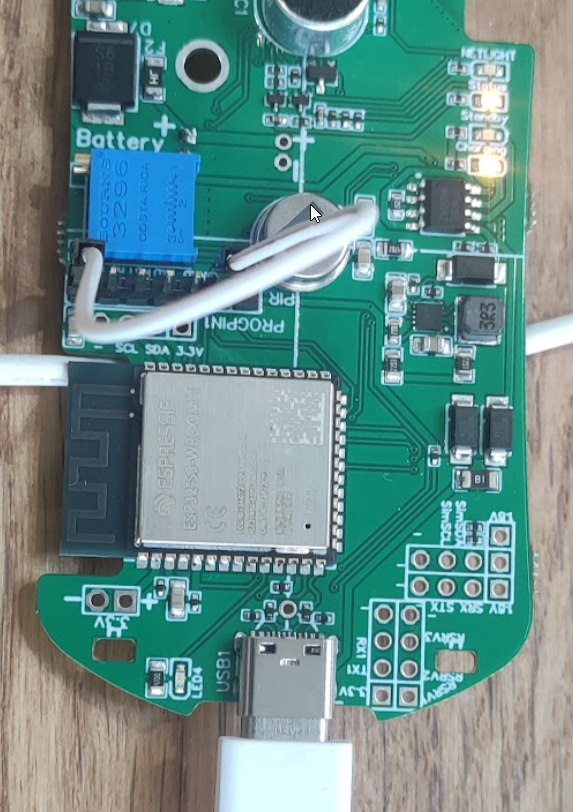
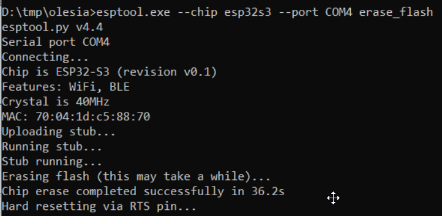

# pirmicboard_david
 repository for interchanging files and test code

## Enter Flash Mode
Bridge GND with GPIO0 via Jumper Cable


## Write Flash

```
esptool.exe --chip esp32s3 --port COM4 write_flash -z 0 GENERIC_S3-20220618-v1.19.1.bin
```

* unplug from USB port
* reconnect with Putty Terminal Software ( https://www.putty.org/ )

